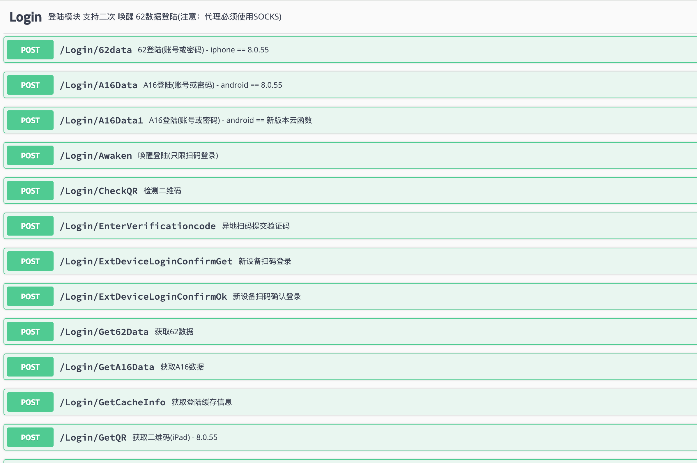

# WeChat-Protocol

# 🔥 微信协议 - 代码可读性高，可用于学习

✨ **- Mac/安卓Pad/iPad/Windows 协议源码**

## 🌟 功能详情

### 📱 基础功能
- 扫码/密码登录，多账号管理
- 消息防撤回
- 消息转发，高效信息传递
- 发群
- 加好友
- 等等

### 💬 消息收发
- 支持文本/图片/语音/视频/文件/名片
- 群发消息，定时发送
- 智能回复，提升效率

## ⚡️ 部署说明
- 🔧 一键部署，专业指导

## 🎁 限时优惠
- 🏷️ 源码版(800$)：完整源代码 + 免费部署指导
- 🏷️ 服务版（功能可定制）：专业技术托管 + 持续更新维护

## 📞 立即咨询
- 💬 Telegram: [@zz](https://t.me/tob_zzz)
- ⚡️ 专业解答
- 🎯 提供演示体验
- 💪 合作共赢，开启营销新时代

📌 **演示截图**

